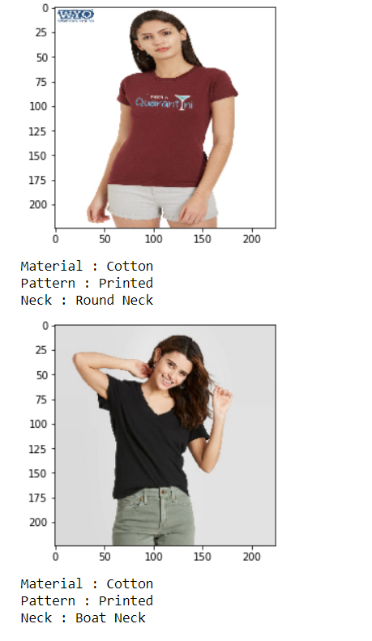

# Fashion-Image-Attributes
In this code pattern, I will create a custom CNN Model using Transfer Learning which takes fashion image URL as input and predict Material , Pattern and Neck Line attributes for input fashion Image.  

# Prerequsite
##### tensorflow: 2.4.0
##### keras: 2.4.3

# Steps
1. Images and Dataset-1  
2. Prepare Image Data  
3. Develop Deep Learning Model  
4. Train and Evaluate Model    
5. Predict Feature on new image

## The shared folder contains the following files
##### 1. dataset 1.xlsx :  This is the given dataset excel file.
##### 2. images folder :  This folder contains the provided images for the dataset.

## About .ipynb file
##### Task2.ipynb : This is the colab notebook for Preparing and Training Model and also predict attributes for a given fashion image simply run this 

# Results

## Accuracy Plot 

## Conclusion
Model is underfit because of less training data

## Scope of Improvement 
Use large dataset & Improvement in Model
